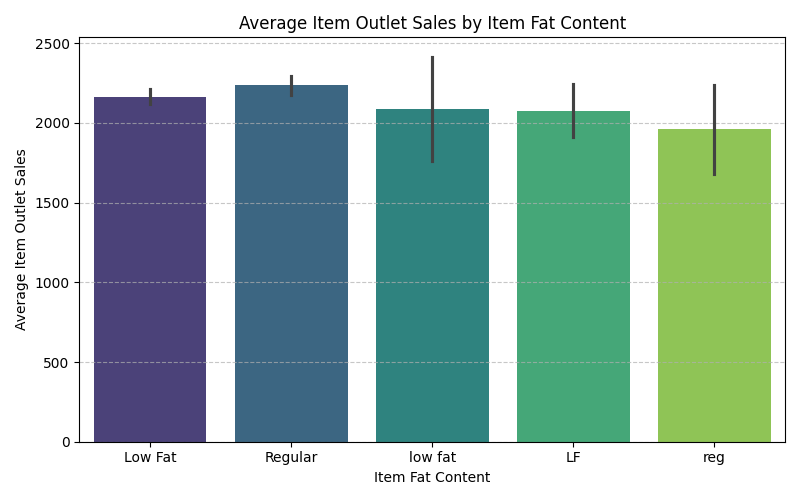

# Predicting Big Mart Product Sales to Optimize Inventory and Revenue

## Identifying the Key Drivers of Retail Sales Performance

**Author**: Mohammed Hussein.

---

### Business Problem

Big Mart needs to accurately forecast product sales across its outlets. Without reliable predictions, the business risks overstocking slow-moving items, understocking popular ones, and misallocating marketing resources.

This project develops a machine learning model to predict `Item_Outlet_Sales` based on product and outlet characteristics — giving stakeholders a data-driven tool for smarter inventory decisions and strategic planning.

---

### Data

- **Source**: Big Mart Sales dataset
- **Size**: ~8,500 product-outlet records
- **Features**: Product attributes (weight, type, MRP, fat content, visibility) and store attributes (outlet type, size, location tier, establishment year)
- **Target**: `Item_Outlet_Sales` — revenue generated per product per store

---

### Key Insights

#### 1. Outlet Type Is the Strongest Driver of Sales

> Supermarket Type3 outlets generate substantially higher average sales than all other formats. Grocery Stores and Supermarket Type2 outlets trail far behind. This highlights store format as the single most impactful variable for revenue — and a critical factor for any future expansion or resource allocation decisions.

#### 2. Item Fat Content Shows a Meaningful Sales Difference

> Products labeled as **regular** fat content consistently outperform low fat items in average sales. Whether this reflects consumer purchasing preferences or the types of products that tend to fall into each category, it is a pattern worth considering when making shelf placement and promotional decisions.

---

### Model

Three models were evaluated: Linear Regression, a default Random Forest, and a tuned Random Forest. The **Tuned Random Forest Regressor** was selected as the final model for its best generalization to unseen data.

**Final Model — Test Set Performance:**

| Metric | Value |
|---|---|
| R² | 0.590 |
| MAE | $739.40 |
| RMSE | $1,063.33 |

The model explains approximately **59% of the variability** in product sales and predicts within an average of **$739** of actual sales figures. While there is room for improvement, this provides a meaningful and reliable baseline for forecasting.

---

### Recommendations

- **Focus expansion on Supermarket Type3 formats** — this outlet type drives the highest revenue and should be prioritized in growth planning.
- **Revisit marketing strategy by fat content** — regular fat products outperform low fat ones, suggesting that consumer demand or product category mix in this group warrants closer attention.
- **Deploy this model for inventory planning** — even at current accuracy, the predictions are reliable enough to inform stock decisions, especially for high-MRP products where mismatches are most costly.

---

### Limitations & Next Steps

- The model shows moderate overfitting (training R² 0.721 vs. test R² 0.590), which could be reduced with further tuning.
- The dataset has no time dimension, so seasonal or promotional effects cannot be captured — a valuable direction for future work.
- Adding external data (competitor pricing, foot traffic, promotions) would likely improve accuracy significantly.

---

### For Further Information

For any additional questions, please contact **Mohammed Hussein** via [LinkedIn](https://www.linkedin.com/in/mohd-husein/) .
