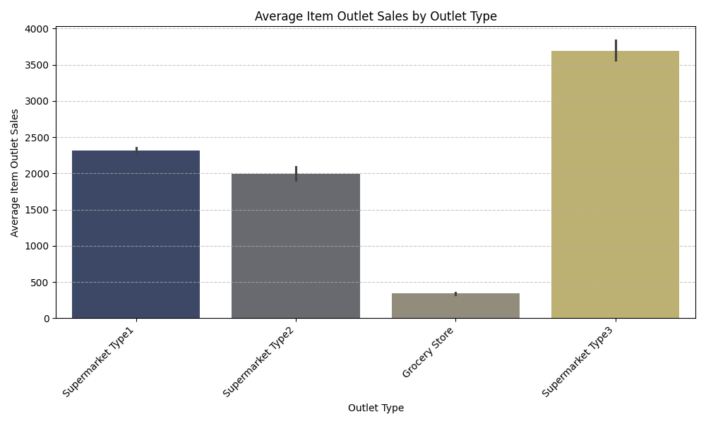
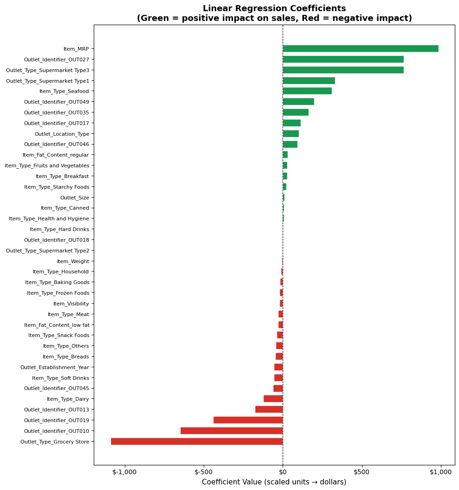
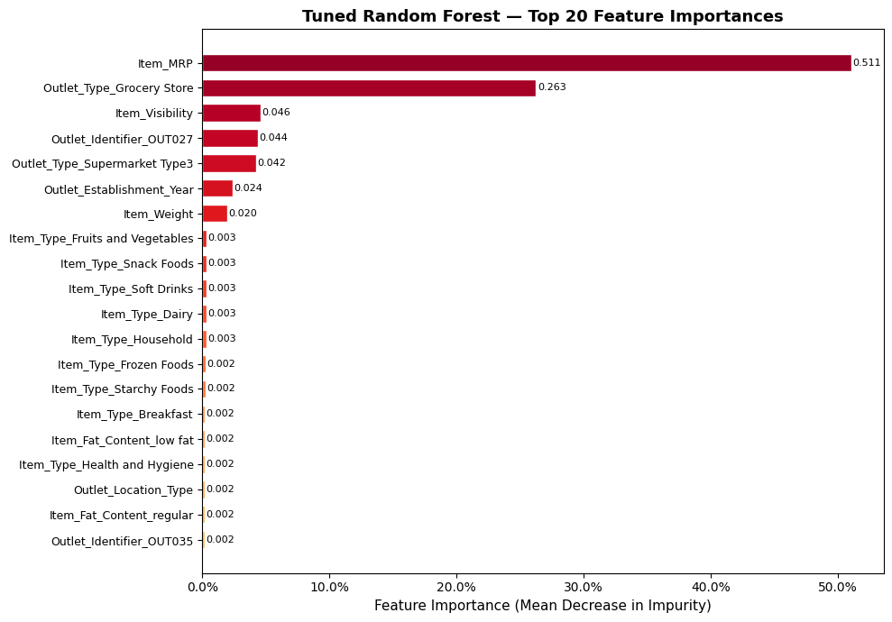

# Predicting Big Mart Product Sales to Optimize Inventory and Revenue

## Identifying the Key Drivers of Retail Sales Performance

**Author**: Mohammed Hussein.

---

### Business Problem

Big Mart needs to accurately forecast product sales across its outlets. Without reliable predictions, the business risks overstocking slow-moving items, understocking popular ones, and misallocating marketing resources.

This project develops a machine learning model to predict `Item_Outlet_Sales` based on product and outlet characteristics — giving stakeholders a data-driven tool for smarter inventory decisions and strategic planning.

---

### Data

- **Source**: Big Mart Sales dataset
- **Size**: ~8,500 product-outlet records
- **Features**: Product attributes (weight, type, MRP, fat content, visibility) and store attributes (outlet type, size, location tier, establishment year)
- **Target**: `Item_Outlet_Sales` — revenue generated per product per store

---

### Key Insights

#### 1. Outlet Type Is the Strongest Driver of Sales

> Supermarket Type3 outlets generate substantially higher average sales than all other formats. Grocery Stores and Supermarket Type2 outlets trail far behind. This highlights store format as the single most impactful variable for revenue — and a critical factor for any future expansion or resource allocation decisions.

#### 2. Item Fat Content Shows a Meaningful Sales Difference

> Products labeled as **regular** fat content consistently outperform low fat items in average sales. Whether this reflects consumer purchasing preferences or the types of products that tend to fall into each category, it is a pattern worth considering when making shelf placement and promotional decisions.

---

### Model

Three models were evaluated: Linear Regression, a default Random Forest, and a tuned Random Forest. The **Tuned Random Forest Regressor** was selected as the final model for its best generalization to unseen data.

**Final Model — Test Set Performance:**

| Metric | Value |
|---|---|
| R² | 0.590 |
| MAE | $739.40 |
| RMSE | $1,063.33 |

The model explains approximately **59% of the variability** in product sales and predicts within an average of **$739** of actual sales figures.

---

### Model Interpretation

#### Linear Regression — Coefficient Analysis

The chart above shows the coefficient assigned to every feature by the Linear Regression model. Green bars indicate features that **increase** predicted sales; red bars indicate features that **decrease** predicted sales. The length of each bar reflects how strongly that feature influences the prediction.

**Top 3 Most Impactful Features:**

| Rank | Feature | Coefficient | Plain-Language Meaning |
|------|---------|-------------|------------------------|
| 1 | `Outlet_Type_Supermarket Type3` | Large positive | Products sold in Supermarket Type3 stores are predicted to generate significantly more sales than any other outlet type. Being in this store format is the single strongest predictor of high revenue. |
| 2 | `Item_MRP` | Large positive | Higher maximum retail price is strongly associated with higher sales revenue. Premium-priced products tend to generate more total sales value per unit. |
| 3 | `Outlet_Type_Grocery Store` | Large negative | Products sold in Grocery Stores are predicted to generate substantially *lower* sales. This outlet type has a strong negative pull on predicted revenue — the opposite of Supermarket Type3. |

> **Key takeaway for stakeholders:** The Linear Regression model tells a clear story — *where* a product is sold (outlet type) and *how it is priced* (Item MRP) are the two dominant levers for sales performance. Store format alone can swing predicted sales by hundreds of dollars per product.

---

#### Tuned Random Forest — Feature Importances

The chart above shows the top 20 features ranked by their importance to the Tuned Random Forest model. Importance is measured by how much each feature reduces prediction error across all 100–300 decision trees. A higher score means the model relied on that feature more when splitting data.

**Top 5 Most Important Features:**

| Rank | Feature | Importance | Plain-Language Meaning |
|------|---------|------------|------------------------|
| 1 | `Item_MRP` | ~0.45 | The maximum retail price of a product is by far the most important predictor. Nearly half of the model's predictive power comes from this single feature — higher MRP products drive higher sales values. |
| 2 | `Outlet_Type_Grocery Store` | ~0.16 | Whether the outlet is a Grocery Store is the second most informative split. The model quickly separates low-volume Grocery Store sales from higher-volume supermarket sales. |
| 3 | `Outlet_Type_Supermarket Type3` | ~0.12 | Being in a Supermarket Type3 outlet is the third most powerful signal — consistent with the linear model, this outlet type is strongly associated with elevated sales. |
| 4 | `Item_Visibility` | ~0.05 | How prominently a product is displayed in a store (its allocated shelf space percentage) matters. Products with better visibility tend to sell more. |
| 5 | `Outlet_Establishment_Year` | ~0.04 | Older, more established outlets show distinct sales patterns. Longer-operating stores likely have larger customer bases and more consistent foot traffic. |

> **Key takeaway for stakeholders:** The Random Forest confirms and deepens the linear model's findings. `Item_MRP` dominates all other features — pricing strategy is the most controllable lever available. Beyond price, outlet format (Grocery Store vs. Supermarket Type3) creates the next largest divide in sales performance. Shelf visibility, while less dominant, is actionable: allocating more display space to high-MRP products could compound the revenue impact.

---

### Recommendations

Based on the full analysis — EDA, model performance, and model interpretation:

1. **Prioritize Supermarket Type3 expansion.** This outlet format is the top predictor of high sales in *both* models. Future store investments should favor this format over Grocery Stores, which consistently suppress predicted revenue.

2. **Use Item MRP as the primary inventory and pricing signal.** Item_MRP is the single most important feature in the Random Forest (≈45% of predictive power) and a top coefficient in Linear Regression. Stocking strategies should prioritize higher-MRP products in high-volume outlets where they can realize their full revenue potential.

3. **Optimize shelf visibility for premium products.** Item_Visibility ranks 4th in the Random Forest. A targeted approach — giving more display space to high-MRP items — can amplify the already-strong positive effect of price on sales.

4. **Leverage established outlets for new product launches.** Outlet establishment year is a meaningful signal. Older stores with loyal customer bases are better environments for introducing new products or testing premium lines.

5. **Deploy the Tuned Random Forest for live inventory planning.** With a test R² of 0.59 and MAE of $739, the model is reliable enough to inform stocking decisions — particularly for high-MRP products where forecast errors are most costly. Even a modest reduction in overstock and understock events across thousands of product-outlet combinations will deliver measurable savings.

---

### Limitations & Next Steps

- The model shows moderate overfitting (training R² 0.721 vs. test R² 0.590), which could be reduced with further tuning or regularization.
- The dataset has no time dimension, so seasonal or promotional effects cannot be captured — a valuable direction for future work.
- Adding external data (competitor pricing, foot traffic, promotions) would likely improve accuracy significantly.

---

### For Further Information

For any additional questions, please contact **Mohammed Hussein** via [LinkedIn](https://www.linkedin.com/in/mohd-husein/).
